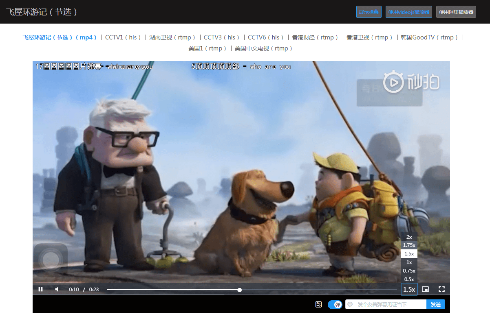

# golive

## Project setup
```
yarn install
```

### Compiles and hot-reloads for development
```
yarn run serve
```

### Compiles and minifies for production
```
yarn run build
```

### Run your tests
```
yarn run test
```

### Lints and fixes files
```
yarn run lint
```

### Run your unit tests
```
yarn run test:unit
```

### Customize configuration
See [Configuration Reference](https://cli.vuejs.org/config/).

<br/><br/><br/>

# **Already have**
## videojs
1. 直播、点播播放， 不同协议流媒体、视频切换播放

## Aliplayer
1. 直播、点播播放， 不同协议流媒体、视频切换播放

## 弹幕CommentCoreLibrary
1. 弹幕CommentManager舞台随视频播放、暂停联动
2. 滚动、固定 弹幕透明度全局配置
3. 鼠标移入CommentObject增添样式
4. 单个弹幕样式独立设置


<br/><br/><br/>


# **Need**
## videojs
1. 视频播放键盘空格键控制，userAction-> hotKeys应用
2. 输出界面大小适配


## Aliplayer
1. 视频播放键盘控制
2. 输出界面大小适配
3. 非Controlebar点击，播放暂停切换
4. 弹幕展示有误（playCurrenttime获取异常）


## 弹幕CommentCoreLibrary
1. 单个弹幕对象，鼠标移入，暂停。 可进行点赞，查看点赞数
2. 弹幕显示区域、字号设置
3. 滚动弹幕速度与视频播放速度匹配
4. 屏蔽词、屏蔽列表实现
5. 视频重播，弹幕重播实现机制（是否需要销毁弹幕舞台，重新生成并加载弹幕）
6. 视频播放结束，弹幕仍处于生存时间内， 如何处理
7. 弹幕是否是一次性加载，根据stime， 添加进runline
8. 存在在 timeline 暂未 send 加入 runline的更新
9. CommentManager随视频界面大小而更改


### **预览**

